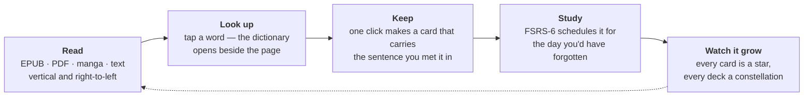
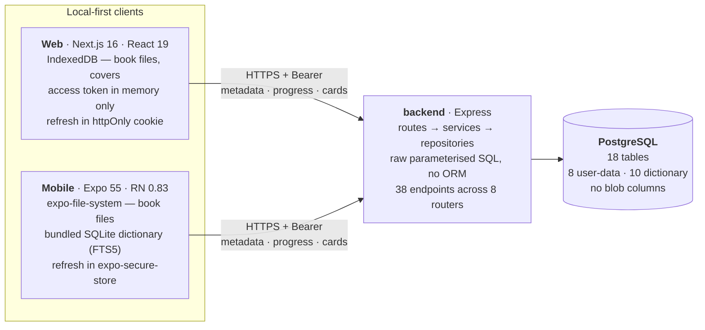

<div align="center">

<picture>
  <source media="(prefers-color-scheme: dark)" srcset="aogimi-brand-assets/app-icon/app-icon-ink-dot-256.png">
  
</picture>

# Aogimi

**Turns the Japanese you actually read into the Japanese you actually know.**

Import your own book · tap a word you don't know · it becomes a flashcard scheduled by FSRS-6 · watch your vocabulary grow into a star map.


</div>

<!-- ═══════════════════════════════════════════════════════════════════════════
     ▶ DEMO VIDEO — drop it here.

     Option A (recommended — real player, audio, scrubbing):
       Drag the .mp4 into any GitHub issue comment, copy the
       https://github.com/user-attachments/assets/<uuid> URL it produces,
       and paste it on its own line below. A relative path to a committed
       .mp4 renders as a plain link, NOT a player.

     Option B (works from a fresh clone, no audio):
       Commit a .gif to docs/media/ and use:
       <div align="center"></div>
     ═══════════════════════════════════════════════════════════════════════ -->

---

<div align="center">

### ▶ Try it

**[aogimi.app](https://TODO-deployed-url)** — nothing to install, runs in any browser.

| Username | Password |
| :------- | :------- |
| `demo`   | `TODO`   |

<sub>Sign-up is closed while the project is in development — the demo account is the way in.</sub>

</div>

---

## What it is

Anyone learning Japanese lives in two places at once: reading a book full of words they don't know, and studying flashcards someone else wrote about words they've never met in a sentence. The two never touch, so the reading stays hard and the studying stays abstract.

Aogimi collapses them into one app. The book, the dictionary and the deck are the same place, and moving between them takes a click.



---

## Screenshots

<!-- ═══════════════════════════════════════════════════════════════════════════
     ▶ SCREENSHOTS — commit PNGs to docs/media/ and uncomment the grid below.
        GitHub markdown ignores image sizing, so the HTML table is what keeps
        this a grid instead of a stack of full-width slabs.

<table>
  <tr>
    <td width="50%"><br><sub align="center"><b>Library</b> — your own files, continue-reading raised to the top</sub></td>
    <td width="50%"><br><sub><b>Reader</b> — the dictionary docked beside the page</sub></td>
  </tr>
  <tr>
    <td width="50%"><br><sub><b>Dictionary</b> — pitch accent drawn, not encoded</sub></td>
    <td width="50%"><br><sub><b>The sky</b> — every card a star, every deck a constellation</sub></td>
  </tr>
  <tr>
    <td width="50%"><br><sub><b>Study</b> — one button, four grades, no plan to configure</sub></td>
    <td width="50%"><br><sub><b>Mobile</b> — the same account on iOS and Android</sub></td>
  </tr>
</table>
     ═══════════════════════════════════════════════════════════════════════ -->

---

## Features

**📚 Bring your own books.** EPUB, PDF, manga and plain text. Novels reflow to your typeface, spacing and page colour; manga gets a page-image reader that turns right to left; Japanese lays out vertically when the book asks for it. Your place is kept across devices — put a book down on the desktop, pick it up on your phone at the same page.

**🔍 A real dictionary, one tap away.** Full JMdict and KANJIDIC2. Meanings grouped by part of speech, pitch accent drawn as a diagram rather than a number to decode, JLPT level, every kanji broken out, example sentences — and deinflection, so 食べさせられなかった resolves to 食べる with the chain of endings that got you there.

**⭐ Cards that remember the context.** One click turns an entry into a card, and it takes the sentence you found it in with it. Make one from a book, from the dictionary, or from the deck screen.

**🧠 Spaced repetition that's honest.** FSRS-6, implemented from the spec with all 21 parameters. Answer Again / Hard / Good / Easy; cards climb **new → met → learned → mastered**, and promotion comes from the memory genuinely lasting longer, never from counting right answers. Grading a card early changes nothing — studying ahead is practice.

**🌌 Progress you can look at.** The deck screen is a star map. Cards added the same day cluster together, so the sky is also a record of when you were studying. Zoom out and thousands of stars resolve into nebulae; rank shows in a star's *shape*, not just its colour, so it reads across the room and works colourblind. Every account gets a permanent seed — your sky is yours and never rearranges itself.

**🔒 Local-first, and your files stay yours.** Book bytes never reach the server. What syncs is the shape of your library: which books you own and how far you've read. No store, no catalogue, no DRM.

---

## Architecture

Three independently-deployable packages, no workspace tool — each with its own `package.json`.



The backend is the only writer to Postgres. Both clients hold the state they need to work offline and push opportunistically. **Book blobs are the hard boundary** — large, the user's own files, and a copyright surface — so they never cross it; Postgres stores only the metadata and fingerprints needed to recognise the same book on another device. The mobile dictionary is a build artefact, not a second source of truth: the Postgres dictionary tables are dumped into one SQLite file with an FTS5 index and shipped in the app bundle.

Full write-up: **[docs/ARCHITECTURE.md](docs/ARCHITECTURE.md)** · **[docs/API.md](docs/API.md)** · **[docs/AUTH.md](docs/AUTH.md)** · **[docs/SECURITY.md](docs/SECURITY.md)** · **[backend/SCHEMA.md](backend/SCHEMA.md)**

---

## Engineering highlights

- **FSRS-6 built from the spec and pinned to a reference.** All 21 parameters, pure — no DB, no user. `scripts/verify-fsrs.js` replays seven review sequences against **py-fsrs 6.3.1**, chosen so a failure localises to one formula. [Details →](docs/ARCHITECTURE.md#3-fsrs-6--the-full-note)
- **No ORM, and a layering rule that holds.** `routes → services → repositories`, where **a repository owns exactly one SQL family and never imports another**. Cross-entity work happens one layer up, where it's visible. Every SQL statement lives in a file named after the table it touches. [Details →](docs/ARCHITECTURE.md#2-backend-layering-in-detail)
- **A ten-layer book-matching chain.** The same book arrives on two devices as two files that usually aren't byte-identical — EPUBs get repacked, PDFs re-saved, scans re-OCRed. Import walks ten signals strongest-first, from `file_hash` down to filename, and **only the strongest is trusted for silent auto-attach**, because a false match destroys the original's reading position. [Details →](docs/ARCHITECTURE.md#6-book-identity-and-the-matching-chain)
- **One token model, two transports.** Browsers and native apps have different threat surfaces, so the web gets an httpOnly refresh cookie scoped to `/api/auth` with no JavaScript-reachable form, and native gets `expo-secure-store`. Refresh tokens are stored as SHA-256 hashes and rotate on every use. [Details →](docs/AUTH.md)
- **Security by default posture.** Identity is the token and never the request; ownership mismatches return **404, not 403**, so IDs can't be enumerated; quotas answer 409; and the production CSP is built around the reader's constraint — foliate renders each EPUB section into a `blob:` iframe that *inherits* the policy, so `connect-src` stays locked to self + the API and a script smuggled in via a malicious EPUB can't exfiltrate. [Details →](docs/SECURITY.md)
- **Five verification harnesses, each pinned to an external reference.** The scheduler is mirrored across three packages and the sky's camera clamp is a fourth mirror; two copies checked only against each other can drift together and both be wrong, so none of them are. Web lint is at **0 errors, 0 warnings**.

---

<details>
<summary><b>Run it locally</b></summary>

<br>

**Prerequisites:** Node 18+ (Node ≥ 22.18 for the `.mts` harnesses, which rely on native type stripping) · PostgreSQL 14+ with `psql` on `PATH` · Xcode or Android Studio for mobile.

```bash
createdb aogimi

# 1. Backend — requires DATABASE_URL, JWT_ACCESS_SECRET, JWT_REFRESH_SECRET.
#    Both secrets must be >= 32 chars or the server throws on boot:
#      node -e "console.log(require('crypto').randomBytes(64).toString('hex'))"
cd backend && cp .env.example .env && npm install
DATABASE_URL='postgresql://…' ./scripts/migrate.sh
npm run dev                      # node --watch, $PORT (default 3000)

# 2. Web
cd web-frontend/aogimi-web && cp .env.example .env && npm install
npm run dev -- -p 3001           # 3000 is taken by the backend

# 3. Mobile
cd mobile-frontend/aogimi-mobile && cp .env.example .env && npm install
npm start                        # Expo Metro; press i or a for a simulator
```

Every variable each package reads is documented in its `.env.example`. `NEXT_PUBLIC_API_URL` must be on the backend's `CORS_ORIGIN` allowlist; `EXPO_PUBLIC_API_URL` must be reachable from the simulator or device, so not `localhost` from physical hardware. `ios/` is generated and untracked — edit `app.json`, then `npx expo prebuild --clean -p ios`.

**Two steps don't work from a fresh clone, both `.gitignore` problems rather than code problems.** Migration `011` needs `backend/jlptwordslist/n{1..5}.csv`, and seeding the dictionary means running the parsers in `helpers/` against `DATABASE_URL` — both paths are ignored. Everything else runs; the app just starts with an empty dictionary.

**Verification** (no unit-test runner — these are the harnesses):

```bash
cd backend                        && node scripts/verify-fsrs.js    # vs py-fsrs 6.3.1
cd web-frontend/aogimi-web        && node scripts/verify-fsrs.mts   # same vectors
cd mobile-frontend/aogimi-mobile  && npm run verify:fsrs            # same vectors
cd mobile-frontend/aogimi-mobile  && npm run verify:sky             # golden values + web equality
cd mobile-frontend/aogimi-mobile  && npm run verify:camera          # worklet vs lib/camera.ts
```

</details>

---

## Status

A personal project under active development, not a shipped product. What works today: importing and reading your own books, the full dictionary, decks and cards, the spaced-repetition runner, the star map, and cross-device sync of everything except the book files.

Known gaps, stated plainly:

- **No unit test suite.** The five harnesses cover the algorithms with the highest cost of being subtly wrong. They cover no route handler, no repository, no auth flow — and the auth surface is what most deserves tests.
- **Registration is closed.** `POST /api/auth/register` returns 403 as the handler's first statement; everything behind it is intact and unreachable. The demo account above is the way in.
- **The scheduler is duplicated three ways.** Only the mobile camera worklet mirror is genuinely forced (Reanimated can't call a shared imported function from the UI thread); the backend/web split is a workspace-tooling gap. The per-mirror harnesses are the mitigation, not the fix.
- **The web light theme is pinned off.** Both palettes exist and every screen is token-driven, but `FORCED_THEME = 'dark'` locks the app to dark pending a design pass over the light palette.
- **Mobile parity is incomplete.** Mid-catch-up to the web in phases. It also carries two things the web doesn't: an offline SQLite dictionary and i18n (en / ja / pt).
- **No password reset, no OAuth, no email verification.** Login is username + password only.

---

<div align="center">
<sub>Dictionary data from <a href="https://www.edrdg.org/jmdict/j_jmdict.html">JMdict</a>, <a href="https://www.edrdg.org/wiki/index.php/KANJIDIC_Project">KANJIDIC2</a> and JMnedict, used under the EDRDG licence.</sub>
</div>
